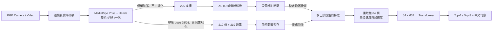

# Sign-Language-Recognition-Gemma — Knee42

> 42 類固定句型台灣手語辨識系統
> 單一 RGB 攝影機 → MediaPipe 骨架 → Transformer encoder → Top-1／Top-3 中文句意


**本 repository 名稱保留 `Gemma`，但目前辨識核心是 MediaPipe ＋ Transformer encoder，與 Google Gemma 無關。** 生成端整合屬後續研究方向。

---

## 目錄

0. [審閱者指引](docs/REVIEWER_GUIDE.md)（教授請從這裡開始）
1. [這是什麼](#1-這是什麼)
2. [目前辨識效果](#2-目前辨識效果)
3. [系統流程與架構](#3-系統流程與架構)
   — [一幀 → 438 維](#32-步驟一一幀畫面--219-個值--219-個遮罩)
   · [一段 → 64×657](#34-步驟三一整段--64--657)
   · [為什麼是 64](#35-為什麼是-64)
   · [訓練 vs 即時](#36-訓練路徑與即時路徑的差異)
4. [公開模型](#4-公開模型)
5. [怎麼跑起來](#5-怎麼跑起來)
6. [如何製作：開發歷程與主要困難](#6-如何製作開發歷程與主要困難)
7. [參考文獻](#7-參考文獻)
8. [資料政策與授權](#8-資料政策與授權)

---

> **審閱者／教授請先看** → [`docs/REVIEWER_GUIDE.md`](docs/REVIEWER_GUIDE.md)
> 該文件把「看懂 → 核對模型 → 自己重訓」排成一條可依序執行的路徑，並說明非公開資料的取得與放置方式。

## 1. 這是什麼

Knee42 是一套**離線執行**的孤立手語句型辨識系統。使用者對著一般 RGB 攝影機比出一段手語，系統自動判斷動作的起訖時間，並將該段落分類為 42 個預先定義的中文句子之一。

**它做什麼**

- 自動偵測手語動作的開始與結束（也支援空白鍵手動錄製）
- 將完成的段落分類為 42 類之一，顯示 Top-1、Top-3 與信心分數
- 完整保存每次會談的原始錄影、切片與時間戳證據
- 沒有相機時可用影片檔走完全相同的推論路徑
- 啟動時以 SHA-256 驗證模型與設定的完整性

**它不做什麼**

- **不是手語翻譯系統。** 只能辨識 42 個已收錄句型，不理解未收錄的句子。
- **不做連續手語解碼。** 不會把連續多句自動斷句並串成通順中文。
- **不是 Gemma。** 辨識核心與大型語言模型無關。
- **不可作為安全關鍵用途。** 目前模型 gate 為 `PROVISIONAL`，見 §2。

### 42 類清單

三個層次構成：`K42_01`–`K42_28` 為日常短句與請求句、`K42_29`–`K42_37` 為九個縣市名的單一 gloss、`K42_38`–`K42_42` 為複合句。三者在動作長度與資訊量上呈梯度，可用以檢驗模型對不同時序複雜度的表現差異。

| | | |
|---|---|---|
| `K42_01` 你好 | `K42_02` 早安 | `K42_03` 晚安 |
| `K42_04` 謝謝 | `K42_05` 對不起 | `K42_06` 再見 |
| `K42_07` 請再說一次 | `K42_08` 請慢一點 | `K42_09` 我聽不懂 |
| `K42_10` 我知道 | `K42_11` 我不知道 | `K42_12` 可以 |
| `K42_13` 不可以 | `K42_14` 我要喝水 | `K42_15` 我要上廁所 |
| `K42_16` 我肚子餓 | `K42_17` 我累了 | `K42_18` 我不舒服 |
| `K42_19` 請幫我 | `K42_20` 我要看醫生 | `K42_21` 現在幾點 |
| `K42_22` 今天星期幾 | `K42_23` 你叫什麼名字 | `K42_24` 你住哪裡 |
| `K42_25` 多少錢 | `K42_26` 太貴了 | `K42_27` 我不要 |
| `K42_28` 我要這個 | `K42_29` 台北 | `K42_30` 新北 |
| `K42_31` 桃園 | `K42_32` 台中 | `K42_33` 台南 |
| `K42_34` 高雄 | `K42_35` 新竹 | `K42_36` 宜蘭 |
| `K42_37` 花蓮 | `K42_38` 我住在台北 | `K42_39` 我在新竹上班 |
| `K42_40` 你住在宜蘭嗎 | `K42_41` 我明天要去花蓮 | `K42_42` 我是桃園人 |

---

## 2. 目前辨識效果

### 2.1 兩條辨識路徑

repository 同時保留兩個模型。**現行路徑是 Transformer**，BiGRU 保留為 legacy 以便對照與回退。

| | 現行（預設） | Legacy |
|---|---|---|
| 模型 | 4 層 Transformer encoder | 2 層 BiGRU |
| 每幀輸入 | 219 值 → 位置＋速度＋加速度 | 219 值 + 219 遮罩 |
| 段落輸入 | `64 × 657` | `64 × 438` |
| 程式進入點 | [`recognition/transformer/`](recognition/transformer/) | [`recognition/realtime/knee42_ivcam.py`](recognition/realtime/knee42_ivcam.py) |
| Bundle | `artifacts/realtime/best_current/` | Release `knee42-model-v11.zip` |

兩者共用同一份**幀層合約**（MediaPipe → 移除 pose 25/26 → 肩寬正規化 → 219 值 + 遮罩），
實作於 [`recognition/realtime/knee42_preprocessing.py`](recognition/realtime/knee42_preprocessing.py)，
分岔點在其後的序列組裝。

### 2.2 現行 Transformer：可宣稱的指標

下表為**留一簽者**（leave-one-signer-out）結果：測試簽者完全不參與訓練，
4 位簽者 × 3 個種子 = 每組 12 次訓練，指標為 macro top-1（各類等權）。

| 實驗組 | H | L | P | X | **平均** |
|---|---:|---:|---:|---:|---:|
| 無預訓練基線 | .738 | .601 | .656 | .472 | **.617** |
| MOC 預訓練 + 微調 | .827 | .861 | .821 | .729 | **.809** |
| 原型分類頭 | .858 | .885 | .810 | .693 | **.812** |
| 鏡像增強（p = 0.3） | .796 | .873 | .845 | .656 | **.793** |
| 個人化微調 | .880 | .906 | .928 | .854 | **.892** |

三項可以直接讀出來的結論：

1. **MOC 預訓練是最大的單一貢獻**：`.617 → .809`，**+19.2 個百分點**。
2. **個人化微調再加 +8.3 pp**（`.809 → .892`），但前提是取得目標使用者本人的資料。
3. **鏡像增強沒有幫助**：`.793` 低於不做鏡像的 `.809`，兩種比例（0.3／0.5）皆然。

**signer X 在每一組都是最低分**（.472 / .729 / .693 / .656 / .854）。
這是跨全部實驗一致的現象，指向該簽者的動作風格與其餘三位差異較大，
是後續補資料時應優先處理的方向。

原始訓練 log 就在 [`docs/evaluation/runs/`](docs/evaluation/runs/)（72 行，每行一次訓練），
上表由 [`scripts/aggregate_knee42_loso_runs.py`](scripts/aggregate_knee42_loso_runs.py) 從中重算：

```bash
python scripts/aggregate_knee42_loso_runs.py     --runs docs/evaluation/runs --out /tmp/check.json
```

輸出應與 [`docs/evaluation/knee42_loso_metrics.json`](docs/evaluation/knee42_loso_metrics.json) 相同。
**這一步不需要特徵快取,任何人 clone 下來都能重算。**

#### 與 legacy BiGRU 的同條件比較

v11 BiGRU 與上表都把 signer H 完全排除在訓練之外，因此可以直接並列：

| signer H（兩者皆完全排除） | macro top-1 |
|---|---:|
| Legacy BiGRU（v11） | 76.35% |
| **Transformer（MOC 預訓練 + 微調）** | **82.7%** |
| Transformer（原型分類頭） | 85.8% |

換模型帶來 **+6.4 個百分點**。

### 2.3 為什麼發布的權重沒有保留測試分數

發布的 `best_model.pt` 是在方法通過上述留一簽者驗證之後，
**用全部四位簽者重新訓練**的版本（見 [`model_card.json`](artifacts/realtime/best_current/model_card.json)）。
因此：

- checkpoint 內的 `val_macro_mixed = 1.0` 來自**不分簽者的隨機 12% 切分**，
  驗證集裡的每位簽者也都在訓練集裡。這是樂觀值，**不是準確率，不可引用**。
- H／L／P／X 四位都在它的訓練資料中，**無法用來重新量測**。
- signer J 的一次性測試額度已由 legacy BiGRU 消耗（`j_once_v6/CONSUMED.json`），不得再用。

所以 §2.2 的數字描述的是**方法**（在個別留一模型上量得），不是這顆權重本身。
要給這顆權重一個獨立分數，需要新的、未參與訓練的資料。

### 2.4 模型驗收狀態：`PROVISIONAL`

未達 READY 的理由：

1. 發布權重缺乏獨立保留測試集（見 §2.3）。
2. 留一簽者結果在 signer X 上明顯偏低（.729），跨簽者穩定性不足。
3. 實機 IVCAM 硬體驗收待完成。

軟體管線與可重現性證據皆已通過：Train/Dev 影片稽核 2,252 列全數 PASS、
特徵快取 2,252/2,252 驗證通過、Transformer 推論路徑與上游參考實作在
300 筆特徵樣本上**逐位元一致**（機率向量最大絕對誤差 0.000e+00）。

### 2.5 Legacy BiGRU（v11）的紀錄

以下為 legacy 路徑的指標，保留以供對照。**它不是目前的辨識模型。**

| 指標 | 值 | 說明 |
|---|---:|---|
| **Dev Macro Top-1**（signer H） | **76.35%** | 42 類等權平均，用於選模 |
| Dev Overall Top-1 | 75.89% | |
| Dev Top-3 | 83.98% | |
| **J Macro Top-1**（signer J，一次性） | **62.34%** | 626 樣本；未參與任何選擇 |
| J Overall Top-1 | 62.46% | |
| J Top-3 | 79.39% | |
| Round 1 三種子 Dev Macro | 75.39 / 69.48 / 76.35 | mean 73.74、population std **3.04 pp** |

來自訓練回合 `20260818_134407`、候選 `round1_seed44`、best epoch 29。

#### 逐類三方對照（legacy BiGRU）

單一準確率無法說明「問題出在哪一層」。下表並排三個獨立來源——Dev（驗證 signer H）、J（一次性測試 signer J）、**即時檢核**（組員以即時模式逐類實測，原始紀錄見 [`docs/evaluation/live_check_42.xlsx`](docs/evaluation/live_check_42.xlsx)）。

分組規則於檢視資料前固定：`Dev < 80%` → D；否則 `J < 80%` → C；否則即時檢核非「辨識度高」→ B；三者皆通過 → A。

| 分組 | 類別數 | 意義 |
|---|---:|---|
| **A** 三方一致可用 | 14 | 目前真正穩定、可直接展示 |
| **B** 模型會、即時不會 | 4 | Dev 與 J 皆 93–100%，僅即時失敗 → 問題在即時分段／擷取路徑，非模型或訓練資料 |
| **C** Dev 通過、J 未通過 | 13 | 整體 J 指標被拉低的來源 |
| **D** 模型本身未學好 | 11 | 與 J 無關，補資料與檢討類別可分性應從此組開始 |

<details>
<summary><b>展開完整 42 類對照表</b></summary>

| 類別 | 句意 | Dev (H) | J（一次性） | 即時檢核 | 自評 | 備註 |
|---|---|---:|---:|---|---:|---|
| **A｜三方一致可用（14 類）** | | | | | | |
| `K42_02` | 早安 | 100% | 100% | 辨識度高 | 55% | 50–60 |
| `K42_03` | 晚安 | 100% | 100% | 辨識度高 | 70% | 70 |
| `K42_07` | 請再說一次 | 100% | 100% | 辨識度高 | 20% | 速度放慢才會高 |
| `K42_09` | 我聽不懂 | 100% | 100% | 辨識度高 | 77.5% | 75–80 |
| `K42_13` | 不可以 | 100% | 100% | 辨識度高 | — | 放慢 |
| `K42_14` | 我要喝水 | 100% | 100% | 辨識度高 | 65% | 60–70 |
| `K42_21` | 現在幾點 | 100% | 100% | 辨識度高 | 75% | 70–80 |
| `K42_22` | 今天星期幾 | 100% | 100% | 辨識度高 | 85% | 80–90 |
| `K42_24` | 你住哪裡 | 100% | 100% | 辨識度高 | 75% | 70–80 |
| `K42_26` | 太貴了 | 100% | 100% | 辨識度高 | 25% | 20–30 |
| `K42_32` | 台中 | 100% | 100% | 辨識度高 | 55% | 50–60 |
| `K42_34` | 高雄 | 100% | 100% | 辨識度高 | 65% | 60–70 |
| `K42_42` | 我是桃園人 | 100% | 93.3% | 辨識度高 | 50% | 50 |
| `K42_38` | 我住在台北 | 100% | 80% | 辨識度高 | 60% | 60 |
| **B｜模型會、即時不會（4 類）** | | | | | | |
| `K42_27` | 我不要 | 100% | 100% | 有問題 | 10% | 落在 2、3 名；誤判「我累了」 |
| `K42_35` | 新竹 | 100% | 100% | 資料有問題 | 12.5% | P 亂比，尚未重訓 |
| `K42_39` | 我在新竹上班 | 100% | 100% | 資料有問題 | 12.5% | P 亂比，尚未重訓 |
| `K42_31` | 桃園 | 100% | 93.3% | 有問題 | 10% | 跳「請幫我」 |
| **C｜Dev 通過、J 未通過（13 類）** | | | | | | |
| `K42_17` | 我累了 | 100% | 78.6% | 辨識度高 | 80% | 80 |
| `K42_16` | 我肚子餓 | 100% | 73.3% | 辨識度高 | 90% | 90 |
| `K42_15` | 我要上廁所 | 100% | 66.7% | 辨識度高 | 35% | 放慢；30–40 |
| `K42_19` | 請幫我 | 100% | 46.7% | 辨識度高 | 75% | 70–80 |
| `K42_05` | 對不起 | 100% | 42.9% | 辨識度高 | 80% | 食指打食指幅度要大 |
| `K42_18` | 我不舒服 | 100% | 40% | 辨識度高 | 80% | 80 |
| `K42_41` | 我明天要去花蓮 | 100% | 6.7% | 辨識度高 | 35% | 30–40 |
| `K42_01` | 你好 | 100% | 0% | 資料有問題 | — | L 影片全相反，尚未重訓；誤判為「我不舒服」 |
| `K42_06` | 再見 | 100% | 0% | 辨識度高 | 75% | 70–80 |
| `K42_08` | 請慢一點 | 100% | 0% | 辨識度高 | 30% | 速度放慢才會高 |
| `K42_11` | 我不知道 | 100% | 0% | 有問題 | 20% | 需跟著搖頭 |
| `K42_29` | 台北 | 93.3% | 73.3% | 辨識度高 | 60% | 60 |
| `K42_40` | 你住在宜蘭嗎 | 80% | 21.4% | 有問題 | 8% | 8 |
| **D｜模型本身未學好（11 類）** | | | | | | |
| `K42_23` | 你叫什麼名字 | 73.3% | 93.3% | 辨識度高 | 40% | 35–45 |
| `K42_04` | 謝謝 | 33.3% | 0% | 有問題 | — | — |
| `K42_12` | 可以 | 13.3% | 93.3% | 辨識度高 | — | 要點頭、放慢 |
| `K42_25` | 多少錢 | 6.7% | 100% | 有問題 | — | 手臂幅度被判為「我知道」 |
| `K42_33` | 台南 | 6.7% | 33.3% | 有問題 | — | — |
| `K42_36` | 宜蘭 | 0% | 40% | 資料有問題 | — | X 亂比，尚未重訓 |
| `K42_10` | 我知道 | 0% | 28.6% | 辨識度高 | 60% | 手須持平面垂直移動 |
| `K42_20` | 我要看醫生 | 0% | 13.3% | 有問題 | — | 一直出現「我累了」 |
| `K42_28` | 我要這個 | 0% | 0% | 有問題 | — | — |
| `K42_30` | 新北 | 0% | 0% | 有問題 | 10% | 跳「台北」 |
| `K42_37` | 花蓮 | 0% | 0% | 有問題 | — | — |

</details>

**C 組不等於「J 資料有問題」。** Dev 帶有選模造成的樂觀偏誤，兩者出現落差本屬預期。且存在反向證據：`K42_12` 可以（Dev 13.3% / J 93.3%）、`K42_25` 多少錢（Dev 6.7% / J 100%）、`K42_23` 你叫什麼名字（Dev 73.3% / J 93.3%）三類是 **J 明顯優於 Dev**。若 J 整批執行不合格，不應出現此方向。較合理的解讀是兩位未見 signer 各有各的難題，屬正常的 signer 變異。

要將 C 組歸因於 J 的錄影品質，需要獨立於分數的證據。本專案已備妥盲標註程序（標註者不知任何分數，逐段判定執行是否合格，再以不合格率與分層準確率驗證），優先審查對象為 C 組中 Dev 100% 而 J 0% 的四類。

---

## 3. 系統流程與架構

### 3.1 完整處理路徑



關鍵設計是**分岔與再合流**：MediaPipe 每幀只跑一次，但輸出兩種表徵——一種給切段狀態機，一種給分類模型，**分段器的輸入絕不進入模型**。兩路在下游相遇：段落起訖時間決定了模型看得到哪些畫面。因此分段品質直接決定辨識表現。

### 3.2 步驟一：一幀畫面 → 219 個值 + 219 個遮罩

MediaPipe 對一幀畫面回傳 Pose 33 點與最多兩隻手各 21 點。程式做三件事：

**（a）選點並攤平。** 保留 Pose 33 點中除索引 25、26（左右膝）以外的 31 點，接上左手 21 點、右手 21 點：

```text
31 × 3  =  93   (pose，已移除 25/26)
21 × 3  =  63   (left hand)
21 × 3  =  63   (right hand)
──────────────
          219   values / frame
```

順序固定為 `pose → left → right`，不可更動。左右手依 MediaPipe 的 **handedness label** 指派，**不是**依偵測陣列順序——這是早期版本的一個實際錯誤來源。

**（b）缺失以 NaN 表示，遮罩由此導出。** 某隻手沒被偵測到時，該區段填入 `np.nan` 而非 0，遮罩則直接取 `np.isfinite(values)`：

```python
values = np.concatenate((pose, left, right))     # 缺失處為 NaN
mask   = np.isfinite(values)                     # 219 個 True/False
```

**這一步是整個特徵設計的關鍵。** 若缺失直接填 0，該值與「關節確實位於座標原點」在數值上完全無法區分，模型會把「看不到手」學成一個特定位置。用 NaN 標記、再由 finite 判斷導出遮罩，就能把「沒觀測到」與「觀測到 0」分開。

**（c）分段器另取一份 225 維視圖。** 同一次 MediaPipe 結果同時導出給自動切段用的向量：Pose 完整 33 點（**不移除膝部**）＋雙手 42 點 = 75 點 × 3 = **225 值**，缺失以 0 填補、**不做正規化**。這份資料只進切段狀態機，**絕不進入分類模型**。

### 3.3 步驟二：肩寬相對正規化

同一個手勢，不同人身高不同、坐得離鏡頭遠近不同，原始座標會差很多。正規化把這些差異洗掉：

```python
center = (左肩 + 右肩) / 2                       # 平移基準
scale  = ‖左肩 − 右肩‖₂  (只取 x, y)             # 縮放基準
points[有效點] = (points[有效點] − center) / scale
```

- **只轉換有效點**，缺失點維持 NaN，不會被填成假座標。
- 雙肩任一缺失時退回備援：以所有有效點的平均為 center、其 x/y 範圍為 scale。
- `scale` 下限箝制在 `1e-3`，避免人離鏡頭極遠時除以近似 0。

正規化後，「手抬到肩膀高度」在任何人身上都會換算成相近的數值，模型學到的才是動作本身而不是某個人的身材。

### 3.4 步驟三：一整段 → `64 × 657`

一句手語的實際長度不固定（本資料集約 1.1–4.4 秒），但模型只接受固定尺寸輸入。
**這是兩條路徑唯一分岔的地方**，前面的幀層合約完全共用。

#### 現行 Transformer：`recognition/transformer/features.py`

```python
filled     = interp_missing(values)                         # NaN 沿時間軸線性內插
positions  = resample(filled, 64)                           # 重取樣到 64 幀
velocity   = np.diff(positions, axis=0, prepend=positions[:1])
accel      = np.diff(velocity,  axis=0, prepend=velocity[:1])
return np.concatenate([positions, velocity, accel], axis=1)  # 64 × 657
```

**內插而非遮罩。** 缺失座標沿時間軸由前後有效值線性內插；整個維度都沒觀測到才填 0。
模型不再收到遮罩通道，改為直接看到連續的軌跡。

**重取樣而非取樣。** `resample` 做的是線性內插，不是取最近幀——短段落被平滑地拉長，
而不是把同一幀重複貼上。

**速度與加速度。** 一階與二階差分**在重取樣之後**計算，因此單位是「每重取樣幀」。
兩個通道的第 0 格重複自身首值以維持長度。位置 219 + 速度 219 + 加速度 219 = **每幀 657 維**。

**不做標準化。** 肩寬正規化後的座標已在可比尺度上，這條路徑不再套用 train-only standardizer。

#### Legacy BiGRU：`materialize_sequence()`

```python
indices      = np.rint(np.linspace(0, len(values) - 1, 64)).astype(np.int64)
sampled      = values[indices]                              # 取樣
standardized = (sampled - mean) / std                       # train-only 標準化
standardized = np.where(sampled_mask, standardized, 0.0)    # 中性填補
return np.concatenate((standardized, sampled_mask.astype(np.float32)), axis=1)
```

逐行說明：

**取樣。** `np.linspace(0, N-1, 64)` 在整段的**頭到尾**之間取 64 個等距位置，再四捨五入到最接近的實際幀。這保證取樣**涵蓋完整動作**而非其中一小段——這是 Temporal Segment Networks 一路的做法（文獻 [11]）。

- `N > 64`（長段落）→ 均勻跳著取，動作愈長取得愈疏。
- `N < 64`（短段落）→ **索引會重複**，等於把幀複製補滿。實務上這是常態而非例外，見 §3.6。
- `N = 0` 會直接拋錯，不會產生無效張量。

**標準化。** 減去訓練集平均、除以訓練集標準差。這組 mean/std **只由 Train（signer L/P/X）統計得出**，Dev 與 Test 的分布不參與，避免資訊洩漏到前處理階段。

**中性填補。** 缺失位置在標準化**之後**填 `0.0`。標準化空間裡的 0 就是**訓練集平均**——也就是「最沒有資訊量」的值。模型不會因為缺失而收到一個偏離的訊號，同時遮罩會告訴它「這格是補的，不要當真」。這是遮罩與填補搭配使用的完整理由：**填補提供一個安全的預設值，遮罩保留「這是補的」這項事實。**

**串接。** 219 個標準化後的值 + 219 個遮罩（轉成 0.0/1.0）= **每幀 438 維**，整段就是 `64 × 438` = 28,032 個數值。

> 兩條路徑對「缺失值」的處理哲學相反：legacy 保留遮罩讓模型自己判斷，現行則直接內插補上軌跡。這也是為什麼兩者的 checkpoint **不可互換**，bundle 各自帶有 `feature_config.json` 並在載入時強制驗證。

### 3.5 為什麼是 64

**沒有任何論文規定是 64。** 文獻支持的只是「取樣必須覆蓋完整動作」這個原則（[11]），長度是本專案自行決定的。

**當初的由來**：64 在專案早期就被寫進**凍結契約**，Round 0 與 Round 1 都已沿用——它是繼承下來的基線，而非長度比較後的結論。契約凍結的意義是：訓練端與即時端必須產生逐位元一致的張量，任一端改動就會使已發布的套件、雜湊帳本與測試同時失效。

**目前支持保留 64 的理由，來自部署端而非訓練端。** 訓練影片其實不短——2,252 部的實際分布為：

| | 秒 | 原始幀數 |
|---|---:|---:|
| 最短 | 2.90 | 72 |
| 中位 | 5.60 | 171 |
| 最長 | 15.71 | 460 |

**沒有任何一部訓練影片的幀數少於 64**，中位數 171 幀在 L=64 下等於約 2.7 : 1 的下取樣。因此「因為影片短所以取 64」並不成立。

真正的限制在即時端：自動分段切出的段落為 1.1–4.4 秒，以約 15 特徵幀／秒計算僅有 **17–66 個特徵幀**。**64 大約就是即時路徑實際能供應的上限**——更長的窗口在部署時不會帶來額外的真實觀測，只會把同樣的觀測內插得更密。

**已知的訓練／部署分布落差。** 訓練影片（中位 5.60 秒）比即時段落（1.1–4.4 秒）長約 2–3 倍，成因是錄影規範要求頭尾各留 0.5–1 秒空白，而自動分段切得較緊（pre-roll 0.60 秒 + safety tail 0.15 秒）。結果是**模型在被抽稀的視角上訓練，卻部署在被內插的視角上**。此落差尚未量化評估，列為已知風險；它也是 §2.3 中 B 組（Dev 與 J 皆達 93–100%、僅即時失敗）的候選解釋之一。

> 上述推算假設訓練端逐幀抽取特徵。若訓練端亦採 `frame_step = 2`，中位特徵幀數約為 85，相關比例須重算。此項待以特徵抽取程式確認。

**誠實的補充：後續實驗顯示更長的窗口在 Dev 上分數更高。**

| Round | 序列長度 | Dev Macro Top-1 | 是否具入選資格 |
|---:|---:|---:|---|
| 1（選定） | **64** | 76.35% | 是 |
| 3 | 96 | **80.95%** | 否：違反凍結的 64 幀契約 |
| 10 | 128 | **83.02%** | 否：違反凍結的 64 幀契約 |

這兩輪的分數都高於選定模型，但依規則不具入選資格。

**這個差距目前尚未被證實。** 上表三個數字**都只跑了 seed 44**，而 Round 1 自身的三種子 Dev Macro 為 75.39 / 69.48 / 76.35——全距 6.87 個百分點、population std 3.04 pp。同種子比較下 96 幀為 +4.60 pp、128 幀為 +6.67 pp，但在這種變異幅度下，單一種子的領先是否能跨種子維持，尚無證據。

**另有一項機制上的疑慮。** 即時路徑每 2 個原始幀才執行一次 MediaPipe，等於每秒約 15 個特徵幀（§3.6）。要供應 96 個特徵幀需約 6.4 秒的原始畫面、128 個需約 8.5 秒，而本資料集的句子長度為 1.1–4.4 秒。也就是說，**更長的序列在即時端不會帶來更多真實觀測，只會把同樣的 30–60 個觀測內插得更密**。Dev 上的增益是否能轉移到即時端，必須另行驗證。

因此序列長度列為**待驗證的開放問題**，而非已知的改進項。要推翻現行 64 幀契約，最低限度需要：96 與 128 各跑 seed 42/43/44，其**三種子平均與最小值**皆優於 Round 1 的對應值（mean 73.74、min 69.48）；通過後才進入契約改版程序，屆時須連同即時端、封裝、完整性清單與全部測試一併重做。

### 3.6 訓練路徑與即時路徑的差異

兩條路徑最終都產出 `64 × 438`，但取得 N 幀原始特徵的方式不同：

| | 訓練／離線評估 | 即時辨識 |
|---|---|---|
| 輸入 | 完整影片檔 | 相機串流 |
| 段落邊界 | 由 manifest 指定（整支影片即一段） | 由 AUTO 觸發狀態機即時判定（§3.8） |
| MediaPipe 執行頻率 | 逐幀 | **每 2 幀一次**（`frame_step = 2`），結果保持給被略過的那一幀供切段器使用 |
| 特徵幀數 N | 影片幀數 | 約為原始幀數的一半 |
| 取樣為 64 | `materialize_sequence` | **同一份契約**，同一組 mean/std |

**即時模式下 N 通常小於 64。** 相機以 30 fps 擷取、每 2 幀跑一次 MediaPipe，等於**每秒約 15 個特徵幀**。要湊滿 64 個特徵幀需要約 128 個原始幀，也就是**約 4.3 秒**——但多數句子只有 1.1–4.4 秒。

實測數字（v13 驗收紀錄）：手動模式 120 原始幀 → **60 特徵幀**；滑動模式 180 原始幀 → **90 特徵幀**。前者就是 N < 64 的情況。

因此**短段落靠重複幀補滿到 64，是即時路徑的常態**。這不是缺陷——`linspace` 產生的重複是均勻分布的，等同於在時間軸上做最近鄰上取樣；但它確實意味著短句的有效時間解析度低於長句，也是短句類別（你好、謝謝、可以）表現較差的可能因素之一。段落若短於 `min_segment_sec = 0.8` 秒（約 24 原始幀 / 12 特徵幀）則直接丟棄，不送入推論。

**滑動模式**（`--mode sliding`）不等待段落結束，而是維持一個 64 特徵幀的滑動窗口，填滿後持續輸出預測。它與 AUTO 模式共用同一組前處理與模型，差別只在段落邊界如何決定。

### 3.7 模型

#### 現行：Transformer encoder

| 項目 | 設定 |
|---|---|
| Backbone | 4-layer Transformer encoder（`norm_first`，pre-LN） |
| Model dim / Heads | 256 / 8 |
| Feedforward | 512（= 2 × model dim） |
| 位置編碼 | 可學習，形狀 `[1, 64, 256]` |
| Dropout | 0.1 |
| Pooling | temporal mean |
| 分類頭 | LayerNorm → Linear → 42 logits |
| 參數量 | 2,304,554 |
| 預訓練 | MOC tsl-core 215 詞分類器，換頭後微調 |
| 推論成本 | CPU 單段約 2–4 ms，不需要 GPU |

自注意力可直接連結段落內任意兩個時間點，這在手語裡對應「起手位置」與「收尾手形」
之間的長距依賴；BiGRU 只能靠隱藏狀態逐步攜帶這項資訊。

#### Legacy：BiGRU

| 項目 | 設定 |
|---|---|
| Backbone | 2-layer Bidirectional GRU |
| Hidden size | 128 |
| Dropout | 0.45 |
| Pooling | temporal mean + max（串接） |
| 分類頭 | Linear → 42 logits |
| Batch / Epochs / Patience | 24 / 45 / 8 |
| Optimizer | AdamW，lr 1e-3、weight decay 1e-4 |
| Loss | Cross-entropy，label smoothing 0.08 |
| Sampler | class-balanced |
| Augmentation | coordinate jitter（scale 0.10、translation 0.035），僅套用於 Train |
| LR schedule | ReduceLROnPlateau + early stopping |
| 選模指標 | Dev Macro Top-1 |

採**雙向**建模的前提是：本任務於段落完整結束後才推論，故正向與反向資訊皆可取得。此前提在零延遲逐幀預測情境下不成立。

### 3.8 即時分段機制

系統啟動時先校準**靜止參考基準**（rest reference），其後判定化約為「顯著偏離參考」與「回歸參考並維持穩定」。介面狀態依序為 `CALIBRATING` → `WAITING` → `SIGNING` → `END_CONFIRM` → `RESULT` → `COOLDOWN`。

| 參數 | 作用 | 值 |
|---|---|---:|
| `pre_roll_sec` | 確認起段後回溯併入的時長 | 0.60 s |
| `start_hold_sec` | 持續偏離參考的最短時間 | 0.10 s |
| `end_hold_sec` | 確認回歸靜止的最短時間 | 0.30 s |
| `end_safety_tail_sec` | 回溯錨點後的緩衝 | 0.15 s |
| `min_segment_sec` | 低於此長度不送入推論 | 0.8 s |
| `cooldown_sec` | 段落終止後的冷卻期 | 0.67 s |
| `reference_seed_sec` | 校準靜止參考所需穩定時間 | 0.5 s |

三項針對實測失效模式的設計：

1. **Pre-roll 回溯（0.30 → 0.60 秒）** — 手語起手多為漸進，門檻確認時開頭已逸失，故持續保留最近 0.60 秒並於確認後回溯併入。
2. **低動作回溯錨點（`low_motion_anchor_v1`）** — 不以「偵測到靜止的時刻」為終點，而回溯至導向該靜止的連續低動作區間起點，再加 0.15 秒 safety tail。同時避免尾段冗長與尾段截斷。
3. **手腕 fallback** — 雙手置於大腿時 MediaPipe Hand landmarks 常整體消失。校準階段另行記錄肩寬正規化後的手腕簽章，手部消失時改由 pose wrists 判定。惟「手部消失」本身絕不構成靜止證據：手腕必須可見、位置符合校準值且低於動作門檻。

### 3.9 離線影片路徑與抽取契約

相機不在場時走同一個模型:`recognition/transformer/landmarks.py` 讀影片、
`segmentation.py` 依手腕動能切段,兩者共用 §3.2–3.5 的合約。CLI 是
[`scripts/analyze_knee42_video.py`](scripts/analyze_knee42_video.py)。

**這裡有三個容易踩錯、而且錯了不會報錯只會讓準確率無聲下降的點。**
訓練特徵是由 [`scripts/prepare_knee42_features_final.py`](scripts/prepare_knee42_features_final.py)
抽取的,任何推論路徑都必須跟它一致:

| 項目 | 必須 | 為什麼 |
|---|---|---|
| MediaPipe 執行模式 | **`RunningMode.IMAGE`** | 訓練抽取、資料驗證與即時推論全部逐幀獨立偵測。`VIDEO` 模式會加入時序追蹤與平滑,產生的 landmark 分布與訓練不同 |
| 畫面翻轉 | **不翻轉**(`horizontal_mirror: False`) | 特徵快取即以未翻轉畫面抽取,手語者左肩落在 +x |
| handedness | **原樣採用** | Tasks API 的標記本就對應未翻轉輸入,前端或後端再做左右交換會把兩隻手對調 |
| pose 模型 | **`pose_landmarker_lite`** | 每個 `.npz` 都記著抽取當時的模型 SHA-256,`full` 版雜湊對不上 |

#### 左肩 x 是健檢,不是鏡像偵測

結果裡的 `left_shoulder_x` 應該接近 **+0.5**。這個值用來確認 **219 維組裝與肩寬正規化沒寫錯**。

它**不能**用來判斷影片是否鏡像:姿態模型會依身體外觀判斷解剖左右,
看到鏡像的人時會把左右標記一起翻過來,於是這個值兩種情況都是正的。
實測四支示範影片,翻轉與不翻轉量到的都是 +0.49x。

真的拿到自拍鏡像影片時,要在**送進 MediaPipe 之前**把畫面轉正
(`analyze_video(..., selfie_flip=True)`)。事後修座標並不等價——
偵測器已經看過鏡像的人了。

---

## 4. 公開模型

### 4.1 模型 bundle

現行模型**直接放在 repository 內**，clone 下來即可使用，不需要另外下載：

```
artifacts/realtime/best_current/
```

| 檔案 | SHA-256 |
|---|---|
| `best_model.pt` | `b72838ac6365d1ad1a8e984716de2c378f046c9f49e67a0581990c6a7d395fb7` |
| `label_map_knee42.json` | `18c8121f8cdfafaf957ba07c7b3181d51055ffdd71493ba27b91c2c7260339b9` |
| `display_text_map.json` | `a2d2e008cf6232b29ee04596e1e1bb418ccf0b0587f41e42471cf22e3b2073a3` |
| `feature_config.json` | `e008475815958769089895ace9d34fdc2e96856488ad675e1279952b9077e430` |
| `runtime_config.json` | `b5c53b27db37caaf852d1245ca4ce82ab1dd16ba7299ea138fef2b3dcb2404a2` |
| `model_card.json` | `11b4657e6aaeb239cdf939707c339ffb41e4ce4fc98d6fae8cdc28a0dc7959d2` |

同一份清單存於 bundle 內的 `integrity_manifest.sha256`，載入時逐項驗證；
JSON 以 CRLF→LF 正規化後計算雜湊，因此 Windows 與 Linux checkout 結果一致。

`label_map_knee42.json` 與 `display_text_map.json` 的雜湊**與 legacy v11 bundle 完全相同**，
代表兩條路徑共用同一份 42 類定義與中文對照，換模型不會動到類別語意。

bundle 可由 checkpoint 重建，重建結果應得到相同雜湊：

```bash
python scripts/build_knee42_transformer_bundle.py \
    --checkpoint <knee42_final_v2.pt> \
    --label-map <label_map_knee42.json> \
    --display-map <display_text_map.json> \
    --metrics docs/evaluation/knee42_loso_metrics.json \
    --out artifacts/realtime/best_current
```

**使用前請先讀 [`model_card.json`](artifacts/realtime/best_current/model_card.json)**，
其中記載這顆權重的訓練切分與「為什麼沒有保留測試分數」（§2.3）。

### 4.2 Legacy 模型

27 類 daily30 BiGRU 位於 [`artifacts/legacy/daily30_27class/`](artifacts/legacy/daily30_27class/)。
42 類 v11 BiGRU 仍由 [Releases](../../releases) 的 `v1.0.0-v13` 提供
（`knee42-model-v11.zip`，SHA-256 `af45a4a50fc67755dd86be1b47fe975120e47a1b9f6850232e294685dd4ac8df`）。

### 4.3 公開範圍

這次公開的是**模型與方法**，不是可直接啟動的 Windows 應用程式。repository 另提供 v13 的訓練、評估、前處理與即時推論原始碼，供審閱方法與重現研究使用；但公開 Release 不含下列項目：

- 原始人物影片與逐筆 `.npz/.npy` 特徵快取
- MediaPipe 的 `hand_landmarker.task`、`pose_landmarker.task`
- 完整 Windows 可攜包與私有 runtime attestation

因此 `knee42-model-v11.zip` **不是獨立可執行程式**。若教授需要實際重訓，請依 §5 私下取得匿名化 manifest 與特徵快取；若需要即時硬體展示，請聯絡專案維護者另行取得必要資產與操作說明。

---

## 5. 怎麼跑起來

### 5.0 三個入口

| 入口 | 用途 | 需要 |
|---|---|---|
| [`webservice/`](webservice/) | 瀏覽器測試站:攝影機、上傳影片、貼連結 | Python 3.12、`.task` 模型 |
| [`scripts/analyze_knee42_video.py`](scripts/analyze_knee42_video.py) | 單支影片辨識(CLI) | 同上 |
| `recognition.realtime.knee42_ivcam` | Windows 即時辨識(legacy BiGRU 路徑) | v11 bundle |

最快的驗證方式是開網頁測試站:

```bash
python -m webservice.server --port 8642
```

瀏覽器開 `https://<主機>:8642`(**必須 https**,攝影機 API 只在安全來源啟用)。
攝影機模式的 MediaPipe **在瀏覽器裡跑,只有骨架座標會送到伺服器,畫面不外傳**。
設定與限制見 [`webservice/README.md`](webservice/README.md)。

> ⚠️ 測試站**沒有身分驗證**,任何連得到該 port 的人都能使用。請綁在受信任網段,
> 或放在會做驗證的反向代理後面。

### 5.1 環境

#### 推論（Transformer，純 CPU）

現行路徑不需要 GPU。以下版本組合已實測可運作：

```bash
conda create -n knee42 python=3.12 -y
conda activate knee42
python -m pip install -r requirements-transformer.txt
```

| 套件 | 版本 |
|---|---|
| Python | 3.12 |
| torch | 2.13.0（CPU 版即可） |
| mediapipe | 0.10.35 |
| numpy | 2.5.0 |
| opencv-python | 5.0.0.93 |

#### 重現訓練（需 Linux／CUDA）

```bash
conda create -n knee42-train python=3.10 pip -y
conda activate knee42-train
python -m pip install -r requirements.lock.txt
```

`requirements.lock.txt` 是目前發布模型的 Linux／CUDA 精確套件版本快照，不適用於 Windows 推論環境。`environment.yml` 僅供快速建立未完全鎖版的基礎環境；如使用該檔，環境名稱為 `slr_runtime`，仍須再安裝 `requirements.lock.txt` 才能對齊訓練版本。`requirements-windows.txt` 僅記錄來源層級推論所需套件；公開 Release 不含完整即時執行資產。

### 5.2 資料取得

**本 repository 不含任何原始影片或特徵快取。** 訓練資料為專案成員錄製的手語影像，涉及個人肖像，依資料政策（§8）不公開。

要重現訓練，需另行取得下列兩項，並放置到指定位置：

| 需要的東西 | 放置位置 |
|---|---|
| Research manifest（Train/Dev 列，含 `split`、`signer_id`、`label_id`、`display_text`） | `artifacts/knee42/manifests/research_manifest.csv` |
| 特徵快取（每樣本 `219 values + 219 mask` 時序） | `artifacts/knee42/features_final/` |

manifest 的欄位規格見 [`docs/schema/manifest_schema.md`](docs/schema/manifest_schema.md)；特徵格式見 [`docs/schema/feature_schema.md`](docs/schema/feature_schema.md)。如審查或重現研究需要原始影片，請私下聯絡專案負責人索取；影片不在公開 repository 或 Release 提供。

> 特徵快取為骨架座標序列，不含任何影像，無法還原為影片。若審閱者需要重現訓練，維護者可個別提供該份快取。

### 5.3 切分政策（強制）

資料依**錄影者**而非依影片切分，以避免模型藉個人特徵獲得虛高分數：

| Split | Signer |
|---|---|
| Train | L、P、X |
| Dev | H |
| Test | **J（僅一次）** |

強制規則：

- 所有診斷、超參數比較與模型選擇**僅得使用 Train／Dev**。
- J 不得用於分析弱類別、挑選實驗或修改模型。
- 最終模型、config、seed、commit、manifest、standardizer 與全部雜湊鎖定並登錄 ledger 之後，方得對 J 執行一次。
- **本專案的 J 額度已於 `20260818_134407` 消耗**，任何後續模型都只能報告 Dev 指標。

此規則由程式強制執行：`recognition/training/knee42_policy.py` 的 `validate_research_rows()` 會在任何 `split=test` 或 `signer_id=J` 的列進入研究程式路徑時拋出 `LeakageError`。

### 5.4 執行訓練

#### Transformer(現行路徑)

```bash
# 一次留一簽者
python scripts/train_knee42_transformer.py --data-root <features> \
    --mode loso --test-signer H --seed 7 --encoder <moc_encoder.pt>

# 產生 §2.2 那張表的完整 sweep（4 簽者 × 3 種子）
python scripts/train_knee42_transformer.py --data-root <features> \
    --mode loso --test-signer H L P X --seed 7 42 2026 \
    --encoder <moc_encoder.pt> --results runs/loso_results.jsonl

# 發布模型：全部簽者，沒有保留分數
python scripts/train_knee42_transformer.py --data-root <features> \
    --mode final --seed 42 --save artifacts/knee42_transformer_final.pt
```

`--data-root` 指向含 `research_manifest.csv` 與 `features_final/` 的目錄。
**訓練全程不碰原始影片。**

[`recognition/training/knee42_transformer.py`](recognition/training/knee42_transformer.py)
直接 import `recognition.transformer` 的特徵管線與模型定義,不另外複製一份——
訓練端與部署端各留一份實作,正是兩者悄悄分岔的典型原因。

`--mode final` 回傳的 `val_macro_mixed` 帶著 `warning` 欄位,並且不含 `test` 欄位:
那個數字**不是**保留估計,理由見 §2.3。

#### Legacy BiGRU

```python
import csv, json
from pathlib import Path
import torch
from recognition.training.knee42_devonly import DevOnlyConfig, train_dev_only

rows = list(csv.DictReader(open(
    "artifacts/knee42/manifests/research_manifest.csv",
    encoding="utf-8-sig", newline="")))
cfg = DevOnlyConfig(**json.load(open("configs/knee42/round1_config.json", encoding="utf-8")))

train_dev_only(
    rows=rows, config=cfg,
    split_hash="<split_sha256>",
    manifest_hash="<manifest_sha256>",
    feature_ledger_hash="<feature_ledger_sha256>",
    feature_dir=Path("artifacts/knee42/features_final"),
    out_dir=Path("artifacts/knee42/iterations/<run_id>/seed44"),
    seed=44,
    device=torch.device("cuda" if torch.cuda.is_available() else "cpu"),
)
```

`train_dev_only` 不會materialize 也不會評估任何 Test 列。

### 5.5 研究流程與 Round 制度

每一輪只變動**單一因素**，並以 JSON 計畫書記錄假設與成功條件：

1. 建立不可變 manifest，驗證 split 與雜湊
2. 只用 Train／Dev 診斷
3. 每輪修改一組因素，先 smoke 再 GPU
4. 依 Dev Macro Top-1 選模
5. 鎖定 final ledger（模型、config、seed、commit、manifest、standardizer、全部雜湊）
6. 最後才執行一次 J-only Test

本模型的實際歷程（Dev Macro Top-1，seed 44）：

| Round | 主要因素 | Dev Macro | 是否具入選資格 |
|---:|---|---:|---|
| 0 | 修正特徵後的基線 | 72.05% | 是 |
| 1 | coordinate jitter | **76.35%** | **選定** |
| 2 | focal loss | 70.78% | 是 |
| 3 | 96 幀 | 80.95% | 否：違反凍結的 64 幀契約 |
| 4 | landmark dropout | 75.56% | 否：沿用 96 幀 |
| 5 | dropout 0.60 | 76.61% | 否：沿用 96 幀 |
| 6 | weight decay 0.001 | 78.08% | 否：沿用 96 幀 |
| 7 | mean pooling | 71.56% | 否：沿用 96 幀 |
| 8 | hidden size 192 | 77.14% | 否：沿用 96 幀 |
| 9 | 單層 recurrent | 79.21% | 否：沿用 96 幀 |
| 10 | 128 幀 | 83.02% | 否：違反凍結的 64 幀契約 |

Round 3–10 雖有更高的 Dev 分數，但違反已凍結的 64 幀輸入契約，依規則不具入選資格。此為刻意的取捨：契約凍結後不得為了追分而更動，否則即時端與訓練端會失去一致性。

### 5.6 測試

```bash
python -m pytest tests/ -q
```

目前 230 項,涵蓋特徵合約、bundle 完整性與竄改偵測、切段邏輯、
訓練協定(留一簽者是否真的把該簽者排除、發布模型是否拒絕宣稱保留分數)、
web service 的 multipart 與 payload 解析,以及封裝與敏感資訊掃描。


```powershell
python -m unittest discover -s tests -p "test_knee42*.py" -v
```

涵蓋 split policy、J Test 防洩漏、rotation、左右手映射、219 維契約、64×438 前處理、standardizer、AUTO trigger、timestamp、錄影速度、second-pass、UI、camera 與模型完整性。Windows 可攜包不在本次公開範圍，其封裝驗收證據維持私有。

---

## 6. 如何製作：開發歷程與主要困難

### 6.1 資料收集規範

- 上半身完整入鏡，雙手不得離開畫面
- 固定機位、單純背景、穩定光線
- 每段開頭與結尾各留 0.5～1 秒空白
- 依指定句型順序比出完整動作

Train/Dev 影片稽核結果：獨立列 2,252（Train 1,634、Dev 618），最終判定 PASS 2,252、FAIL 0、REVIEW 0；解碼失敗 0；SHA 重複群組 0；套用的水平翻轉 0。整體關鍵點缺失率 4.73%（Train 4.95%、Dev 4.14%）。

### 6.2 六個主要困難

**影片方向 metadata。** 大量影片帶有非零 container rotation metadata，但 OpenCV 不會自動套用，造成方向錯誤與骨架特徵嚴重失真。實測分布為 0° 173 部、90° 1,050 部、180° 1,029 部——**超過九成的影片方向是錯的**。修正後 Dev Macro Top-1 自 43.42% 提升至 76.35%（+32.93 pp）。這是整個專案影響最大的單一修正。

**左右手與 handedness。** MediaPipe 的偵測陣列順序不等於左右手，必須依 handedness label 映射；缺失的手由遮罩表示。稽核 2,252 筆全數為正常方向，無 slot-swap 旗標。

**自動切段邊界。** 早期版本出現開頭切太晚、結尾留太長、段中短暫低動作被誤判為結束、雙手放腿上後 landmark 消失導致無法終止等問題。逐項以 pre-roll、低動作回溯錨點、手腕 fallback 解決（見 §3.8）。

**固定 30 FPS 假設造成錄影快轉。** 早期以「幀數 ÷ 相機回報的 30 FPS」推算時間，但實際擷取率約 17.5 FPS，導致錄影播放呈約 1.71 倍加速，也連帶使所有時間門檻失準。v14 起改用 `perf_counter` 真實時間戳，並將擷取、推論、UI、錄影拆成四條互不阻塞的執行緒。

**Signer 與姿勢差異。** 動作速度、慣用手、手勢幅度、鏡頭距離及坐姿／站姿都會造成分布差異。目前以 signer-independent 的 Dev split 評估泛化能力。

**離線與即時的落差。** 部分類別在 Dev 與 J 皆達 100%，卻在即時模式失敗（§2.3 的 B 組）。這指出分段模組的驗收指標必須同時涵蓋**邊界精度**與**段落召回率**——兩者是獨立且可反向變動的品質維度。

### 6.3 版本歷程

| 版本 | 主要變更 | 狀態 |
|---|---|---|
| v9–v12 | 分段稽核、2K 可調視窗、側欄骨架顯示、E2 版面與效能 | 已納入 v13 |
| **v13** | 安全邊界策略（pre-roll 0.60、回溯錨點、手腕 fallback）；E2 版面凍結 | **本次發布的版本** |
| v14 | 以真實時間戳取代合成時鐘；擷取／推論／UI／錄影四執行緒分離 | 修正錄影加速問題 |
| v15 | 即時特徵快取；新增 adaptive re-arm 狀態 | 段落召回劣化，未發布 |
| **v12 模型** | 辨識核心改為 4 層 Transformer encoder；`64 × 438` → `64 × 657`（位置／速度／加速度）；MOC 215 詞預訓練 | **現行模型**，BiGRU 轉為 legacy |

**為什麼換成 Transformer。** 在同一組留一簽者協定下，signer H 的 macro top-1 由 BiGRU 的
76.35% 提升到 82.7%（§2.2）。主要來源不是架構本身，而是 MOC 215 詞語料的預訓練——
無預訓練的 Transformer 基線只有 .617，加上預訓練後才到 .809。

**為什麼發布 v13 而不是更新的版本。** v13 存在一項已定位的計時缺陷（合成時鐘導致錄影播放加速約 1.71 倍），但該缺陷的作用域限於錄影保真度與設定值語意，未改變送入模型的特徵契約，且時鐘在 v13 內部是自洽的——所有門檻皆於同一時鐘下實測校準，分段行為穩定。v15 則在離線 A/B 重播中出現整段漏切（12 段對 v13 的 14 段，並有 10.6 秒與 11.4 秒的完全不觸發空窗），段落召回劣於 v13。在辨識可用性的優先序下，v13 為現行運作基準。

---

## 7. 參考文獻

本系統並非單一論文的實作，而是將數項已受同行研究驗證的構件組合為一個小型即時流程。下表標註每項方法選擇的依據與其**支持範圍**。

| 方法選擇 | 文獻依據 | 支持強度與限制 |
|---|---|---|
| RGB 影像抽取手部／身體關鍵點 | [1] [2] | 強。直接支持單一 RGB 相機的即時關鍵點估計，不涉及下游分類準確率 |
| 以關節軌跡作為動作表徵 | [6] [7] | 強。支持骨架序列為有效的動作分類表徵；本系統採較簡的 BiGRU |
| GRU 與雙向序列建模 | [3] [4] [5] | 強。適用於已完成的孤立片段；不適用於零延遲逐幀預測 |
| pose-based 手語辨識與跨 signer 評估 | [8] [9] [10] | 很強。直接屬孤立手語辨識領域，並支持 signer-independent 評估協定 |
| 跨全片段的固定長度稀疏取樣 | [11] | 中。支持「取樣須覆蓋完整動作」的原則，不支持長度必為 64 |
| 顯式觀測遮罩 | [12] | 中。支持將缺失資訊顯式編碼；本系統未實作其 decay 機制 |
| 類別再平衡 | [13] | 中。支持 class re-balancing；最佳 sampler 仍須由 Dev 驗證 |
| Label smoothing | [14] | 強。支持正則化原理；0.08 是專案超參數，非論文規定 |
| AdamW + weight decay | [15] | 強。支持 optimizer 選擇；lr 與 decay 值仍須實驗 |
| Focal loss（研究候選） | [16] | 僅支持「值得測試」；本專案 Round 2 的 Dev 結果較差，未採用 |

### 書目

1. F. Zhang et al., **MediaPipe Hands: On-device Real-time Hand Tracking**, 2020. https://arxiv.org/abs/2006.10214
2. V. Bazarevsky et al., **BlazePose: On-device Real-time Body Pose Tracking**, 2020. https://arxiv.org/abs/2006.10204
3. K. Cho et al., **Learning Phrase Representations using RNN Encoder-Decoder for Statistical Machine Translation**, EMNLP 2014. https://aclanthology.org/D14-1179/
4. J. Chung et al., **Empirical Evaluation of Gated Recurrent Neural Networks on Sequence Modeling**, 2014. https://arxiv.org/abs/1412.3555
5. M. Schuster and K. K. Paliwal, **Bidirectional Recurrent Neural Networks**, IEEE TSP, 1997. https://doi.org/10.1109/78.650093
6. Y. Du, W. Wang, and L. Wang, **Hierarchical Recurrent Neural Network for Skeleton Based Action Recognition**, CVPR 2015.
7. S. Yan, Y. Xiong, and D. Lin, **Spatial Temporal Graph Convolutional Networks for Skeleton-Based Action Recognition**, AAAI 2018. https://doi.org/10.1609/aaai.v32i1.12328
8. D. Li et al., **Word-level Deep Sign Language Recognition from Video (WLASL)**, WACV 2020.
9. H. R. Vaezi Joze and O. Koller, **MS-ASL: A Large-Scale Data Set and Benchmark for Understanding American Sign Language**, BMVC 2019. https://arxiv.org/abs/1812.01053
10. O. M. Sincan and H. Y. Keles, **AUTSL: A Large Scale Multi-modal Turkish Sign Language Dataset and Baseline Methods**, IEEE Access, 2020. https://doi.org/10.1109/ACCESS.2020.3028072
11. L. Wang et al., **Temporal Segment Networks: Towards Good Practices for Deep Action Recognition**, ECCV 2016. https://arxiv.org/abs/1608.00859
12. Z. Che et al., **Recurrent Neural Networks for Multivariate Time Series with Missing Values**, Scientific Reports, 2018. https://doi.org/10.1038/s41598-018-24271-9
13. Y. Cui et al., **Class-Balanced Loss Based on Effective Number of Samples**, CVPR 2019.
14. C. Szegedy et al., **Rethinking the Inception Architecture for Computer Vision**, CVPR 2016.
15. I. Loshchilov and F. Hutter, **Decoupled Weight Decay Regularization**, ICLR 2019. https://arxiv.org/abs/1711.05101
16. T.-Y. Lin et al., **Focal Loss for Dense Object Detection**, ICCV 2017.

### 哪些是文獻支持的，哪些是本專案自行決定的

**文獻能直接或間接支持**：RGB pose／hand landmark 抽取、關節軌跡可用於動作分類、GRU 與雙向建模、signer-independent split 是較可信的泛化評估、missingness mask、class balancing、label smoothing、AdamW，以及取樣應覆蓋完整動作。

**必須由本專案的 Dev 實驗支持**：序列長度恰為 64、219 維的組成與移除 pose 25/26、肩寬正規化的具體公式、hidden size 128、2 層、dropout 0.45、mean+max pooling、label smoothing 0.08、coordinate jitter 幅度、seed 44 與最佳 epoch、以及全部 trigger 閾值。

**這些設定不應被書寫為「論文證明最佳」。** 正確的表述是：依上述研究選擇合理候選，再以本專案的 signer-independent Dev set 進行單因素比較。

---

## 8. 資料政策與授權

### 8.1 不公開的內容

原始影片、signer 個人資訊、contact sheets、本機與雲端絕對路徑、私有 manifest、特徵快取、J 的逐筆預測，以及任何憑證。

### 8.2 公開的內容

程式碼、config template、manifest 與 feature schema、匿名統計、model card、評估摘要、SHA-256 帳本、防洩漏測試，以及經授權的模型權重。

### 8.3 授權

- **程式碼**：[MIT License](LICENSE)
- **模型權重**：CC BY-NC 4.0 — 允許研究、教學與非商業測試，須標註來源。權重由專案成員錄製的影像訓練而成，商業使用不在成員同意範圍內。
- **第三方**：MediaPipe、PyTorch、OpenCV 等維持各自原始授權，見 [THIRD_PARTY_NOTICES.md](THIRD_PARTY_NOTICES.md)。MediaPipe 的 `.task` 模型檔**不隨本專案散布**；Google 官方資產另行提供，不屬於本 repository 或本次 Release，若有需要請聯絡專案維護者。

### 8.4 引用方式

```bibtex
@software{knee42_2026,
  author  = {Mikullee and Knee42 Project Team},
  title   = {Knee42: Fixed-Sentence Sign Language Recognition},
  year    = {2026},
  version = {1.0.0},
  url     = {https://github.com/Mikullee/Sign-Language-Recognition-Gemma}
}
```

### 8.5 已知限制

- 只能辨識已訓練的 42 個固定句型，不理解未收錄的句子
- 不是連續手語翻譯系統
- 遮擋、過暗、逆光或人物離鏡頭過遠會降低效果
- 快速連做兩句而未回到休息姿勢，可能被合併成一段
- 模型結果不能取代專業手語翻譯服務
- 模型 gate 為 `PROVISIONAL`，不得作為安全關鍵用途

### 8.6 問題回報

歡迎以 GitHub Issue 回報相機、Windows 啟動、雜湊驗證、MediaPipe、錄影速度、AUTO 邊界及顯示問題。請附上 Windows 版本、相機型號、APP／MODEL 版本與錯誤訊息，但**請勿在公開 Issue 上傳含人物影像的原始影片**；若除錯確實需要影片，請私下聯絡專案負責人。

---

## Legacy

repository 保留兩份已被取代但仍可執行的資產，**兩者都不是目前的辨識模型**：

| 資產 | 位置 | 說明 |
|---|---|---|
| 27 類 daily30 BiGRU | [`artifacts/legacy/daily30_27class/`](artifacts/legacy/daily30_27class/) | v0.1.0 時期的固定句型模型（`T01`–`T30`，不含 `T09`/`T24`/`T26`），`best_dev_top1` 0.418。auto-trigger 的離線邊界評估仍以它為對照基準。 |
| 27 類版本文件 | [`docs/legacy/`](docs/legacy/) | v0.1.0 的說明與快速開始 |
| 42 類 v11 BiGRU | Release `v1.0.0-v13` | 上一代 42 類模型，指標見 §2.5 |

**這三者的類別集合與特徵合約各不相同，checkpoint 不可互換。**
載入時的 `feature_config.json` 驗證會擋下錯配，不會靜默地跑出錯誤結果——
這正是先前 `artifacts/realtime/best_current/` 裡放著 27 類模型、
文件卻描述 42 類系統的問題所要避免的。
